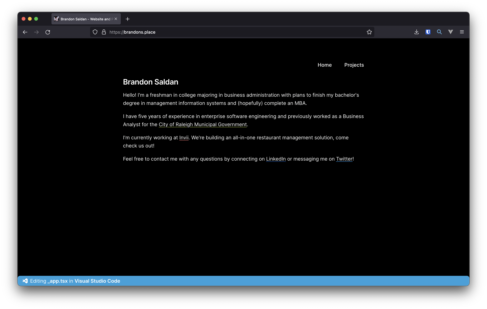
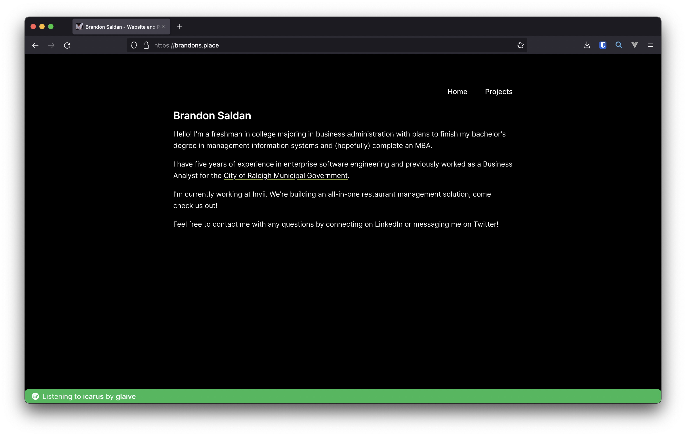

# Clover
   

Clover is an open-source personal website and portfolio built with NextJS, Tailwind, Lanyard, and Geist.




## Getting Started

Fork/clone this repo and run:

```sh
npm install
npm run dev
```

To use [Lanyard](https://github.com/Phineas/lanyard), join their server and add your Discord ID on line 5 of `status.tsx`

```sh
const data = useLanyardWs("PASTE_ID_HERE");
```

More information on Lanyard and how to use it can be found on its repo.

## Attributions

- [Lanyard](https://github.com/Phineas/lanyard) - [@phineyes](https://twitter.com/phineyes)
- [use-lanyard](https://github.com/alii/use-lanyard) - [@alistaiiiir](https://twitter.com/alistaiiiir)
- [Geist](https://github.com/geist-org/geist-ui) - [geist-ui](https://geist-ui.dev/)


## Meta

Brandon Saldan – [@brandonsaldan](https://twitter.com/brandonsaldan) –[in/brandonsaldan](brandonsaldan)

Distributed under the GPL license. See ``LICENSE`` for more information.

[https://github.com/brandonsaldan](https://github.com/brandonsaldan)
